# 使用uniapp + uniCloud实现小程序登录功能
我们主要使用uniapp + uniCloud在没有后端的情况下实现小程序登录的整个过程，从而了解云函数

### 学前准备

#### 注册一个小程序
1. 个人也是可以注册小程序的，只是有些功能不能使用

2. 需要准备一个未注册过微信公众号和小程序的邮箱

3. 前往注册[小程序注册](https://mp.weixin.qq.com/wxopen/waregister?action=step1&token=&lang=zh_CN)

4. 获取AppID 和AppSecret 

    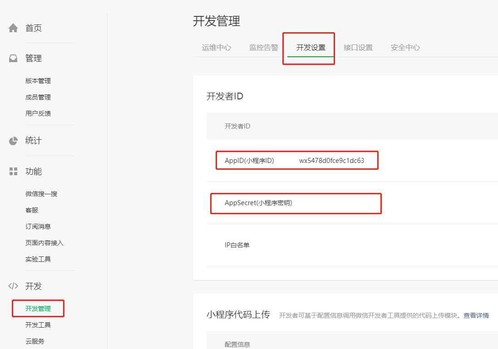

#### 注册一个uniCloud

如果您还未开通过uniCloud，请在web界面开通：<https://unicloud.dcloud.net.cn/> 

然后在开发之前我们需要详细了解一下小程序的登录流程

### 小程序登录流程

 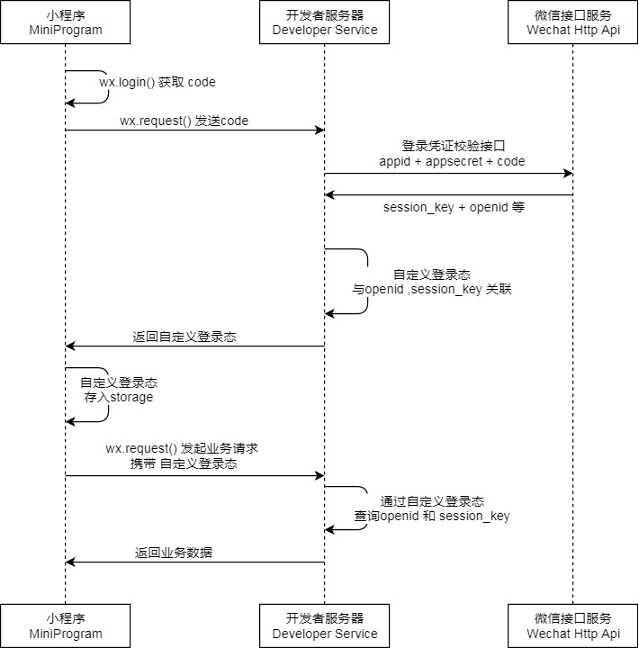

[来源小程序开发文档](https://developers.weixin.qq.com/miniprogram/dev/framework/open-ability/login.html)

这图的意思是先要在小程序端通过wx.login获取到code，然后再通过http请求发送code到开发者服务器，然后再由开发者服务器通过http请求发送相关参数到微信接口服务器获取到openid.
开发者服务器获取到openid之后，便可以做相关操作，比如入库注册会员，然后再返回相关的数据状态给小程序端，一般是生成一个token返回给小程序端，小程序端拿到token，缓存起来，在请求相关接口的时候在http的header里带上token。
现在有了云函数，开发者服务器部分的工作则可以由前端来完成，这也是云开发的相关过程。
比如上述的小程序登录过程，小程序端获取到code之后，不再请求开发者服务器的api，而是请求一个云函数，然后再云函数里通过云函数提供的http请求工具函数去请求微信接口服务器获取openid,然后在云函数里把相关的数据进行入云数据库的操作，再把相关数据返回给小程序端。

### 创建uniCloud项目

按uniCloud官网文档指引建立一个uniCloud项目【[传送门](https://uniapp.dcloud.io/uniCloud/quickstart?id=%e5%88%9b%e5%bb%baunicloud%e9%a1%b9%e7%9b%ae)】

 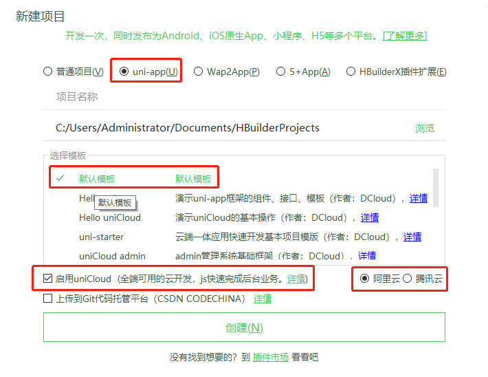


```javascript
<button open-type="getUserInfo" @getuserinfo="login">登录</button>
```

uni-app [button登录组件](https://uniapp.dcloud.io/component/button)

**open-type 有效值** 

 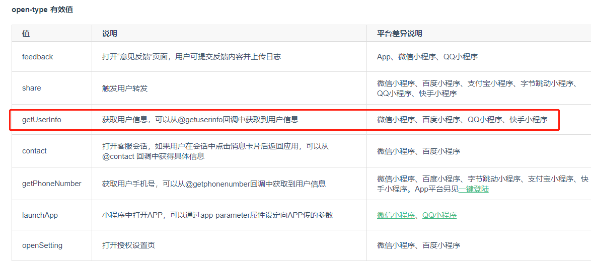

 接下来我们要在login函数中实现登录的相关逻辑函数，要使用
 [wx.getUserProfile(Object object)](https://developers.weixin.qq.com/miniprogram/dev/api/open-api/user-info/wx.getUserProfile.html)来获取微信用户信息，这个动作微信规定需要用户手动授权触发，所以我们要使用[uni.showModal(OBJECT)](https://uniapp.dcloud.io/api/ui/prompt?id=showmodal)来然后用户手动触发授权动作，用户触发授权动作之后获取了用户的相关信息之后还要通过[uni.login(OBJECT)](https://uniapp.dcloud.io/api/plugins/login?id=login)函数获取登录的code，因为微信接口服务器需要通过code换取 openid、unionid、session_key 等信息，详细可以通过微信开发文档了解详细逻辑，微信接口文档[wx.login(Object object)](https://developers.weixin.qq.com/miniprogram/dev/api/open-api/login/wx.login.html)


```javascript
methods: {
    login() {
        uni.showModal({
            title: '温馨提示',
            content: '亲，授权微信登录后才能正常使用小程序功能',
            success(res) {
                if (res.confirm) {
                    uni.getUserProfile({
                        desc: "注册用户信息使用",
                        lang: "zh_CN",
                        success:(res) => {
                            console.log('res', res)
                            uni.login({
                                provider: 'weixin',
                                success: function(loginRes) {
                                    console.log('loginRes.authResult',loginRes);
									// 在这个地方普通开发中就应该去调用后端给的api进行登录操作了
									// 现在这个地方我们需要换成云函数进行相关操作
                                }
                            });
                        }
                    })
                } else {
                    uni.showToast({
                        title: '您取消了授权',
                        duration: 2000
                    });
                }
            }
        })
    }
}
```

### 关联云服务空间

在根目录的uniCloud目录右键选择`关联云服务空间或项目`

 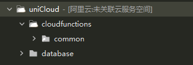

在弹框中选择创建云服务空间

 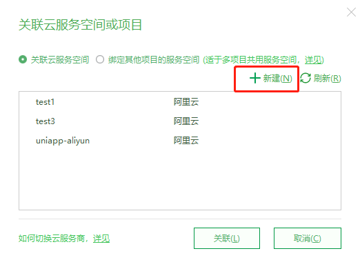

然后弹出web链接的框中

 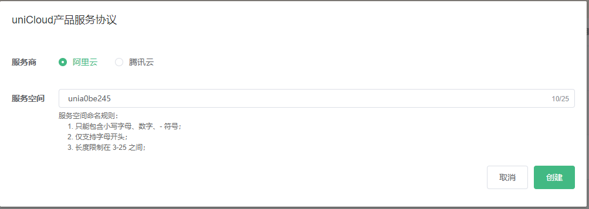

命完名之后，云数据库就创建好了

 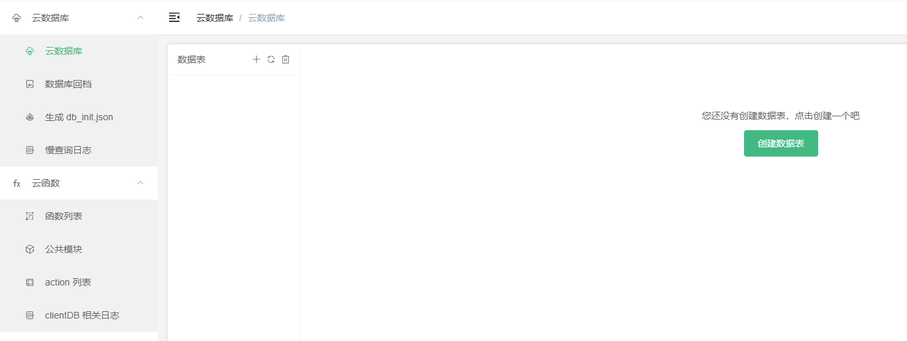

然后回答编辑器刷新选择刚刚创建的云数据库就完成整个关联云服务空间了

 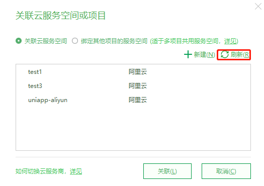

关联了云服务空间之后，我们就要创建一个云函数，我们在根目录下的uniCloud目录里的cloudfunctions目录右键进行新建云函数。

 

在弹出框中我们给这个云函数进行命名，因为我们现在进行用户注册相关数据信息，所以我给它命名为`user`。

 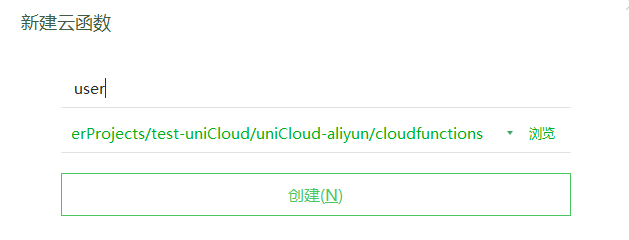

所谓云函数，我的理解就是它的名字就是一个数据表，然后我们在里面进行和这个数据表相关的业务操作。

我们看看云函数最初的样子

 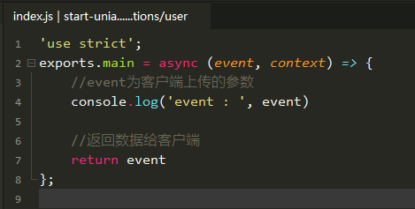

### 云函数使用

接下来我们要使用[uniCloud云函数](https://uniapp.dcloud.io/uniCloud/cf-functions?id=api%e5%88%97%e8%a1%a8)在我们刚刚的小程序端的登录业务函数里进行调用我们创建的云函数`user`。

####  [客户端调用云函数](https://uniapp.dcloud.io/uniCloud/cf-functions?id=clientcallfunction)

前端代码（H5前端、App、小程序），不再执行uni.request联网，而是通过`uniCloud.callFunction`调用云函数，`callFunction`定义如下：

##### [请求参数](https://uniapp.dcloud.io/uniCloud/cf-functions?id=%e8%af%b7%e6%b1%82%e5%8f%82%e6%95%b0)

| 字段 | 类型   | 必填 | 说明                 |
| ---- | ------ | ---- | -------------------- |
| name | String | 是   | 云函数名称           |
| data | Object | 否   | 客户端需要传递的参数 |

##### [响应参数](https://uniapp.dcloud.io/uniCloud/cf-functions?id=%e5%93%8d%e5%ba%94%e5%8f%82%e6%95%b0)

| 字段      | 类型   | 说明                     |
| --------- | ------ | ------------------------ |
| result    | Object | 云函数执行结果           |
| requestId | String | 请求序列号，用于错误排查 |

##### [示例代码](https://uniapp.dcloud.io/uniCloud/cf-functions?id=%e7%a4%ba%e4%be%8b%e4%bb%a3%e7%a0%81)

通过uniCloud开发文档我们知道了客户端调用云函数的示例，下面我们看一下示例吧。

```javascript
// promise方式
uniCloud.callFunction({
    name: 'test',
    data: { a: 1 }
  })
  .then(res => {});

// callback方式
uniCloud.callFunction({
    name: 'test',
    data: { a: 1 },
    success(){},
    fail(){},
    complete(){}
});
```

我们选择 promise方式调用云函数

 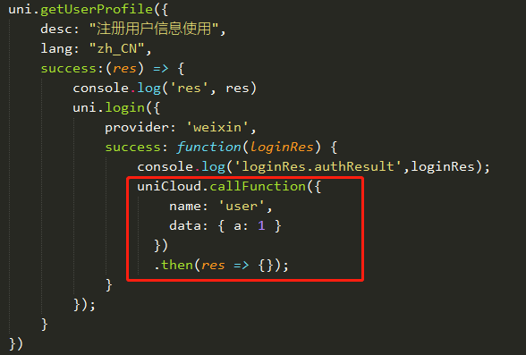

然后我们去微信开发工具端调用一下看看

微信开发工具控制台的打印数据

 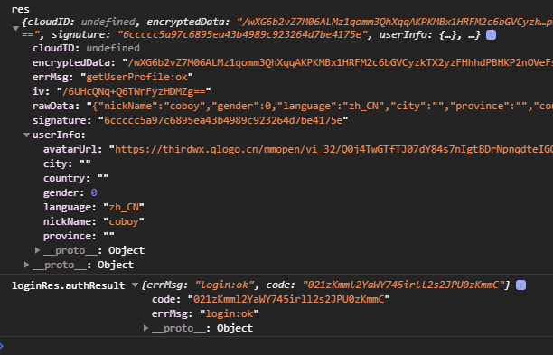


然后回到uniapp的开发工具控制台看一下

 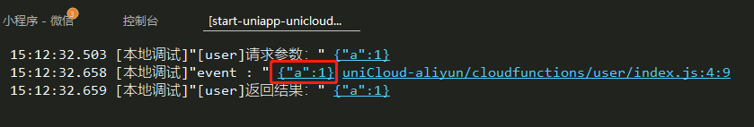

然后我们发现uniCloud.callFunction调用函数的参数中的data数据就是云函数中的event参数

接下来我们把微信登录需要的参数全部补充完整

 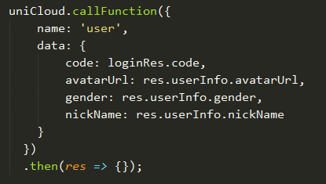

云函数中也接收到了相关参数

 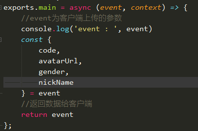

接下来我们要详细看看小程序开发文档中有关登录获取openid的文档

[auth.code2Session](https://developers.weixin.qq.com/miniprogram/dev/api-backend/open-api/login/auth.code2Session.html)

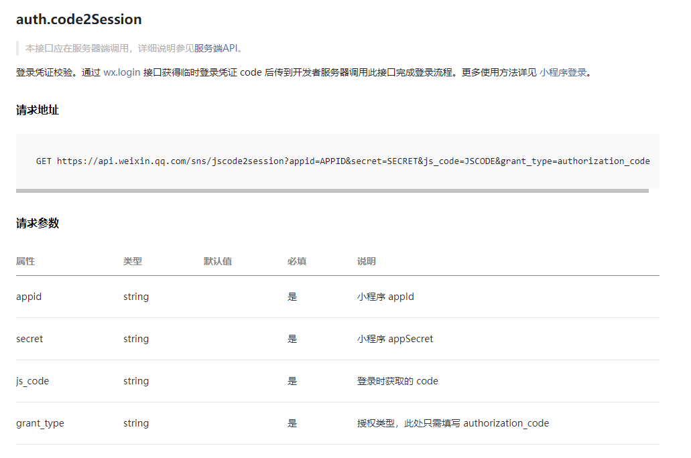

我们看到我们要访问微信接口服务器需要在云函数中通过http请求，uniCloud也提供了相关http工具函数：[访问HTTP服务](https://uniapp.dcloud.io/uniCloud/cf-functions?id=httpclient)
实现云函数user相关逻辑
```javascript
'use strict';
const appid = ''
const secret = ''
exports.main = async (event, context) => {
	//event为客户端上传的参数
	console.log('event : ', event)
	const {
		code,
		avatarUrl,
		gender,
		nickName
	} = event
	const URL = `https://api.weixin.qq.com/sns/jscode2session?appid=${appid}&secret=${secret}&js_code=${code}&grant_type=authorization_code`
	const requestOptions = {
		method: 'GET',
		dataType: 'json'
	}
	const res = await uniCloud.httpclient.request(URL,requestOptions)
	console.log('res', res)
	//返回数据给客户端
	return event
};
```

我们通过uniCloud提供的http函数获取到了openid

 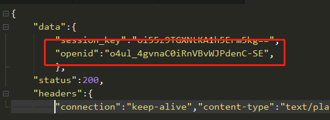

接来下我们要把openid和相关数据存储到云数据库中
这个时候我们就又要回到uniCloud的开发文档中查询云数据库操作的相关文档了
[云函数操作云数据库](https://uniapp.dcloud.io/uniCloud/cf-database)

 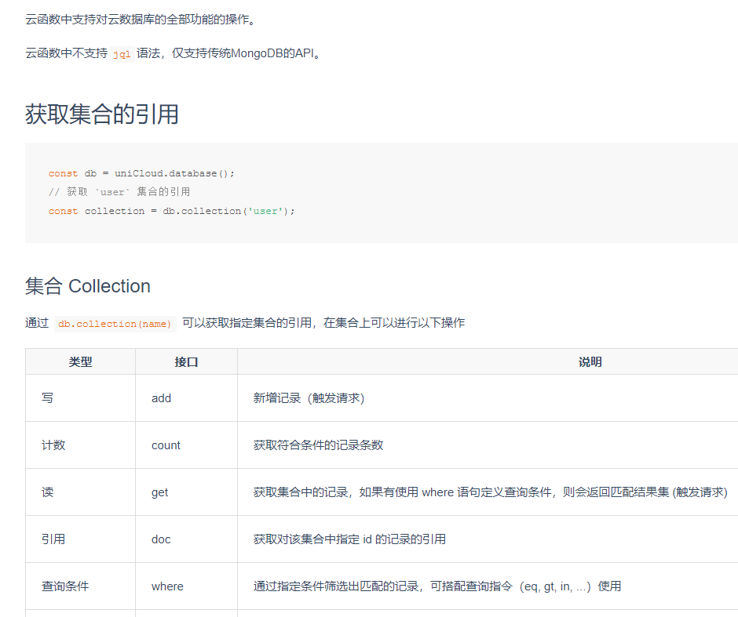

最终云函数的实现

```javascript
'use strict';
const appid = 'wx5478d0fce9c1dc**'
const secret = '445cf16777099d73d9a282c37cf505**'
const db = uniCloud.database();
const user = db.collection('user');
exports.main = async (event, context) => {
	//event为客户端上传的参数
	console.log('event : ', event)
	const {
		code,
		avatarUrl,
		gender,
		nickName
	} = event
	const URL = `https://api.weixin.qq.com/sns/jscode2session?appid=${appid}&secret=${secret}&js_code=${code}&grant_type=authorization_code`
	const requestOptions = {
		method: 'GET',
		dataType: 'json'
	}
	const res = await uniCloud.httpclient.request(URL,requestOptions)
	const { data: { openid } } = res
	const countRes = await user.where({openid}).count()
	console.log('count', count)
	if(countRes.total !== 1 ) {
		user.add({
			openid
			avatarUrl,
			gender,
			nickName
		})
	}
	//返回数据给客户端
	return {
		openid
		avatarUrl,
		gender,
		nickName
	}
};
```

整个项目我已经上传到了github上了

[github地址传送门](https://github.com/amebyte/start-uniapp-unicloud)